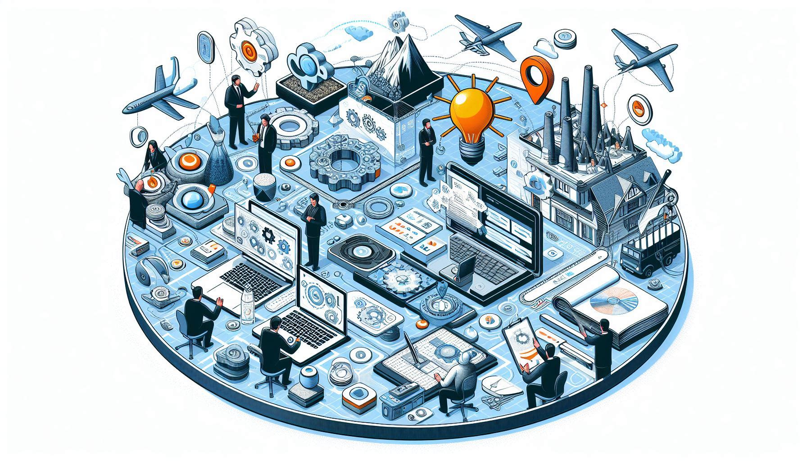

# Domain-Driven Design Events Deep Dive

**Domain-Driven Design (DDD)** is an approach to software development that focuses on the domain of the problem you are trying to solve. It is a way of thinking about software development that emphasizes the importance of understanding the domain and modeling it in a way that reflects the business requirements.

**Events** are a key concept in Domain-Driven Design (DDD). They are used to capture changes in the domain and communicate them to other parts of the system. Events are a way to decouple different parts of the system and make it easier to maintain and evolve the system over time.
